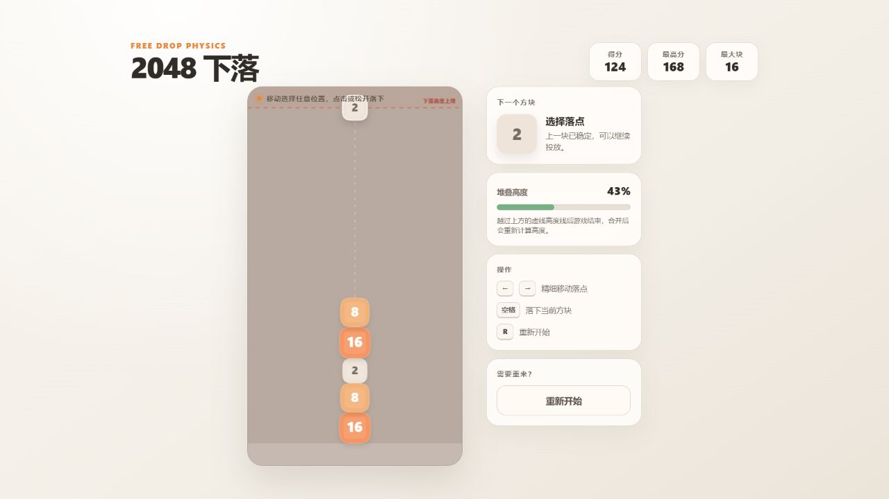

# 2048 下落

在线试玩：<https://qianeeeyeeee.github.io/gravity-2048/>

重力下落式 2048。方块可以自由选择任意横向落点，支持连续投放、软弹性碰撞和合成优先判定。



## 游戏特点

- 任意横向位置投放，不限制列或网格。
- 数字块受重力下落，具有圆角碰撞体积和柔和弹性。
- 相同数字接触后优先合成，不会被普通碰撞先弹开。
- 上一个方块仍在下落时，可以继续投放下一个方块。
- 堆叠高度越过顶部起始线后结束游戏。
- 合成时播放随方块等级升高的合成音效。
- 合成得分等于合成后方块的数值。
- 界面不显示功能按钮，得分与下一个方块保持常驻显示。
- 最高分保存在本机浏览器数据中。

## 操作

- `←` / `→`：调整落点。
- `空格` / `Enter` / `↓`：落下当前方块。
- `R`：重新开始。
- 鼠标或触屏也可以自由选择落点。

## 项目结构

```text
src/                              游戏网页源码
packaging/Gravity2048.ico         程序图标
packaging/Gravity2048Launcher.cs.template
                                  Windows 启动器模板
build/build-windows-exe.js        本地与 CI 共用的打包脚本
.github/workflows/build-windows.yml
                                  GitHub Actions 自动构建与发布
```

## Windows EXE

启动器会把压缩后的 HTML 嵌入单个 `Gravity2048.exe`。运行后游戏放在：

```text
%LOCALAPPDATA%\Gravity2048\gravity-2048.html
```

随后调用系统 Edge 的应用模式，因此没有浏览器地址栏，并保留独立窗口的游戏体验。电脑没有检测到 Edge 时，会退回默认浏览器打开。

在 Windows 上构建：

```powershell
node build/build-windows-exe.js
```

输出：

```text
dist/Gravity2048.exe
dist/Gravity2048.exe.sha256
```

也可以直接打开网页源码运行：

```text
src/gravity-2048.html
```

## 推送到 GitHub

首次推送：

```powershell
git init -b main
git add .
git commit -m "Initial commit"
git remote add origin https://github.com/<你的用户名>/<仓库名>.git
git push -u origin main
```

工作流会在以下操作时自动运行：

- 推送到 `main`：构建 EXE 并上传为 Actions artifact。
- 提交 Pull Request：验证 EXE 能否正常构建。
- 手动触发：在 Actions 页面选择 `Build Windows EXE`。
- 推送 `v*` 标签：构建 EXE、创建 GitHub Release 并上传文件。

发布版本示例：

```powershell
git tag v1.0.0
git push origin v1.0.0
```

GitHub Actions 使用 `windows-latest` 和系统自带的 .NET Framework `csc.exe` 编译，不需要安装第三方 npm 依赖。发布后的 EXE 可以从仓库的 **Releases** 页面直接下载。

## 说明

GitHub 上常见的“网页打包成 EXE”通常有两种方式：

1. Electron：把 Chromium 和 Node.js 一起打包，完全独立，但文件通常几百 MB。
2. 系统 WebView / Edge 启动器：EXE 内嵌网页，渲染交给系统浏览器，文件很小。

本项目采用第二种方式，所以 `Gravity2048.exe` 体积较小，但运行 Windows 版时需要系统 Edge。若以后需要完全独立、不依赖系统的版本，可以把启动器替换为 Electron 或 Tauri 构建流程，网页源码和 GitHub Actions 结构都可以继续复用。
